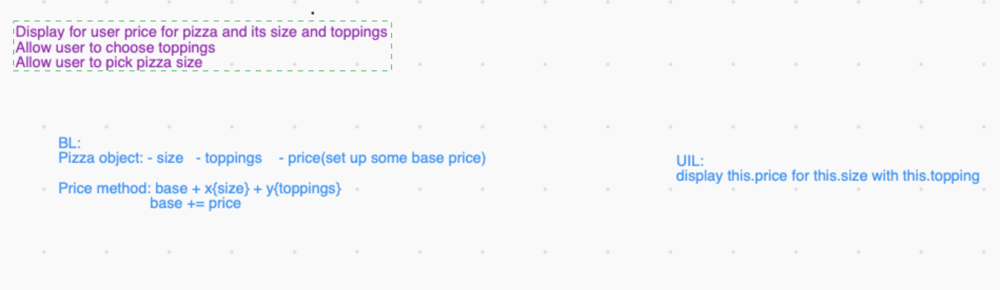

## Pizza Parlor
#### *Epicodus Project #4  on 1/29/2021*
***By Daniel Adeyemi***
___

## *Description:*
### *Tired from not knowing how much your pizza will cost you? Time to try this app and forget about uncertainty* 
This web page will give you choice of pizza's sizes and toppings and displays price based on those choices. This project is concluding my forth week at [Epicodus](https://www.epicodus.com) and focus on building constractors for objects and methods for prototypes.

## *Whiteboarding of bussiness logic*

## *Tests*
**Describe: `constractor Pizza(size, [toppings]) {size, toppings[array], price(base price = $7)}`**  ✅    
 
**Describe: `Pizza.prototype.finalPrice = function(size, [toppings])`**   
**Formula: `finalPrice = base price($7) +2$ for each size up + 1$ for each topping`
#### Test 1:
**Test:** *display current price and selection*   
**Expect:** *pizza.finalPrice(small,[cheese, pepperoni]).toEqual(small, cheese, pepperoni, $7)*
#### Test 2:   
**Test:** *adjust price depending on size*   
**Expect:** *pizza.finalPrice(small).toEqual($7)*    
**Expect:** *pizza.finalPrice(medium).toEqual($9)*    
**Expect:** *pizza.finalPrice(large).toEqual($11)*    
#### Test 3:   
**Test:** *adjust price with one topping*   
**Expect:** *pizza.finalPrice(medium , cheese).toEqual($10)*   
#### Test 4:   
**Test:** *adjust price with multiple toppings*   
**Expect:** *pizza.finalPrice(medium, [cheese, pepperoni]).toEqual($11)*   
**Expect:** *pizza.finalPrice(medium, [cheese, pepperoni, BBQ Chicken]).toEqual($12)*    
**Expect:** *pizza.finalPrice(large, [cheese, pepperoni, BBQ Chicken]).toEqual($14)*    

## *Setup instructions:*
#### From the web:
* Go to my GitHub repository, using following [URL](#).
* Click the "Code" and click the 'Download zip' option.
* Unzip the file, navigate to the root directory.
* open ***'index.html'*** file with your web browser.
#### From the terminal: 
* Clone my repository from GitHub using `git clone #`
* Navigate to the downloaded folder using ***cd*** command
* Execute **code .** command in your terminal and it will open all source code in your code editor.    
*Note: please, make sure that you are inside project directory!*
#### GitHub pages:
*GitHub page is unavailable for this project*

## *Tecnologies used:*
* HTML
* CSS
* Java Script
* JQuery
* Bootstrap *v5.0.0 beta*
* Git and GitHub

## *Known bugs:*
This project has almost no style and was used only for practice purporse.

## *License and copyright:*

> ***© Daniel Adeyemi, 2021***   
> *Licensed under [MIT license](https://mit-license.org/)*